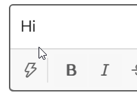

# auto-kaomoji

Minimal phrase input panel for windows built with AutoHotKey. Works great for kaomoji(顔文字( ﾟ∀。)) or emoji(✨).

## Usage

Install [AutoHotKey](https://www.autohotkey.com/) and run the [script](AutoKaomoji.ahk) in Unicode. Or run the [executable](AutoKaomoji.exe) directly.

Press `Alt+Shift+X` to input kaomoji.

Kaomojis are saved in `Kaomoji.txt` in the same directory as the script/executable, one kaomoji per line. No **TAB** is allowed in kaomojis. Please use `UTF-8 ROM` encoding or Unicode characters won't work. After updating the list, relaunch the script to load.

Put a link to the script/executable into `shell:Startup` folder to start it with Windows.

## About

Thanks https://github.com/berban/Clip for providing a neat way of sending strings without triggering IME, etc.

Thanks https://gist.github.com/JaHIY/31b086b6b4326e86d15e for the sample list of kaomoji. (And of course thanks to adnmb.com and ATM ( ﾟ∀。))
